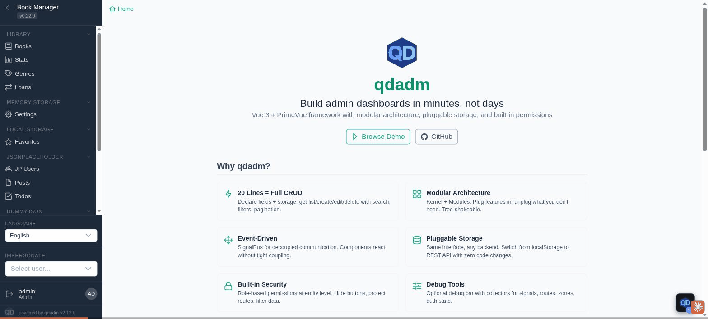

# Debug bridge — qdadm for AI agents

Every qdadm app is **self-describing at runtime**: the framework exposes its
kernel, entity managers, routes, signals and state through a debug bridge
that an AI agent (or you, in the console) can introspect and drive — no
source-code access needed.



## `window.__qdadm` — the in-page bridge

Available in every running qdadm app (including static production builds):

| Key | What it gives you |
|-----|-------------------|
| `kernel` | The Kernel instance (options, layouts, features) |
| `orchestrator` | Entity managers: `getRegisteredNames()`, `get(entity)`, `isRegistered(entity)` |
| `router` | The vue-router instance (`getRoutes()`, `push()`) |
| `signals` | Signal bus (`on`, `emit`) |
| `hooks` | Hook registry (alter/invoke) |
| `zones` | Zone registry (UI composition blocks) |
| `activeStack` / `stackHydrator` | Current navigation chain (entity → id → child…) |
| `i18n` | I18n instance (locale, domains) |
| `debug` | Debug collectors (`describe()` manifests, `dump()` snapshots) |

## Agent session (real transcript)

Run against the **public demo** — nothing installed, nothing mocked. This is
the session captured in the GIF above:

```js
// 1. What am I looking at?
const q = window.__qdadm
q.orchestrator.getRegisteredNames()
// → ['users','countries','products','settings','favorites','jp_users',
//    'posts','todos','books','genres','loans','roles']
q.router.getRoutes().length          // → 43

// 2. Read some data
const books = q.orchestrator.get('books')
await books.list({ page_size: 3 })
// → { items: [{ title: 'Dune', … }, …], total: 8 }
books.idField                        // → 'bookId'
books.canCreate()                    // → true (permission-checked)

// 3. Act — same path the UI uses (signals, cache, permissions included)
await books.create({
  title: 'Written by an AI agent',
  author: 'Claude',
  year: 2026,
  genre: 'sci-fi',
})
// → persisted; the list page picks it up like any user-created record
```

`AGENTS.md` (repo root) is the operational how-to for agents working ON the
qdadm codebase; this page is about driving a qdadm APP from the outside.

## MCP server — one connection, full arsenal

Install [`@quazardous/qdadm-mcp`](https://github.com/quazardous/qdadm/tree/main/packages/qdadm-mcp)
and any MCP-capable agent debugs the live app directly:

```ts
// vite.config.ts
import { qdadmMcpPlugin } from '@quazardous/qdadm-mcp'
plugins: [vue(), qdadmVitePlugin(), qdadmDebugPlugin(), qdadmMcpPlugin()]
```

```bash
claude mcp add --transport http qdadm http://localhost:5174/__qdadm/mcp
```

Tools: `session_info` (zombie-tab detector), `boot_errors` (captures
failures from BEFORE the app booted), `routes`, `entity_state`,
`entity_list/get/create/update/delete` (through the manager — permissions,
cache and signals apply; `readOnly: true` to disable writes),
`storage_dump` (raw localStorage view to diff against the manager),
`recent_signals`, plus `describe`/`bridge_call` for collector discovery.
Every response carries a session stamp. Dev-server only by construction —
the endpoint cannot exist in a production build.

## Dev-server HTTP endpoints

With the debug vite plugin enabled, the bridge is also reachable over HTTP —
no browser required:

```ts
// vite.config.ts
import { qdadmDebugPlugin } from '@quazardous/qdadm/vite-plugin-debug'
plugins: [vue(), qdadmVitePlugin(), qdadmDebugPlugin()]
```

| Endpoint | Returns |
|----------|---------|
| `GET /__qdadm/` | Index + cache stats |
| `GET /__qdadm/sessions` | Connected browser sessions |
| `GET /__qdadm/describe.json` | Collector manifests — what can be inspected/called |
| `GET /__qdadm/snapshot.json` | Live state dump |
| `POST /__qdadm/call` | `{ collector, action, args? }` — invoke a collector action |

Every browser tab gets a session id; endpoints accept `?session=<id|latest>`.

## Debug bar

The optional in-app debug bar (`debugBar` kernel option, see the demo)
surfaces the same collectors visually: entities, routes, signals timeline,
auth state, i18n domains.
